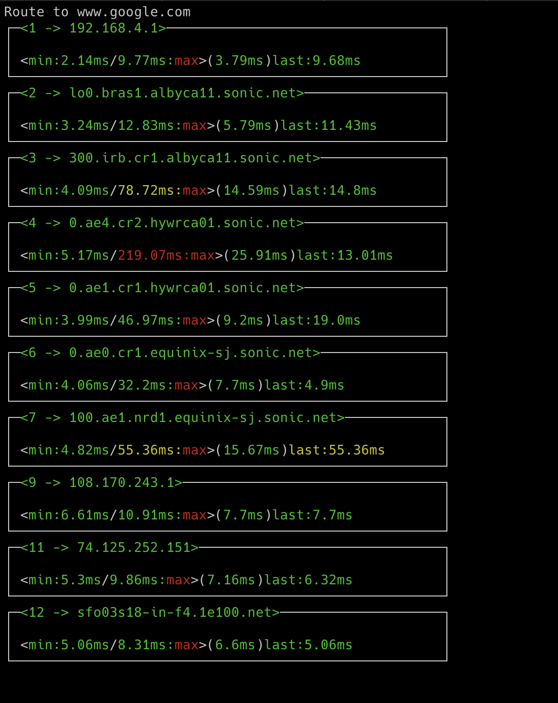

# Conmon

A hobby project to build a CURSES interface to show where the slow hops are between you and a remote host.

## Installation

Right now you just need to clone this repository and use `mix` to run it. The next step would be to add the ability to pass command line arguments (like what to ping). At the moment it pings google, but this can easily be changed on line 39 of `commandserver.ex`.

